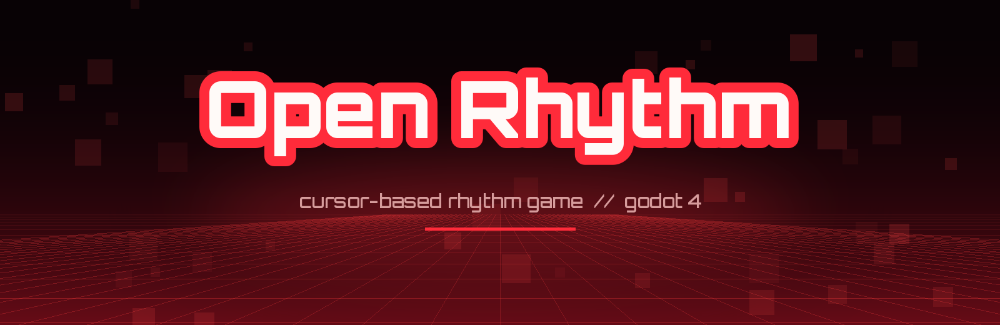
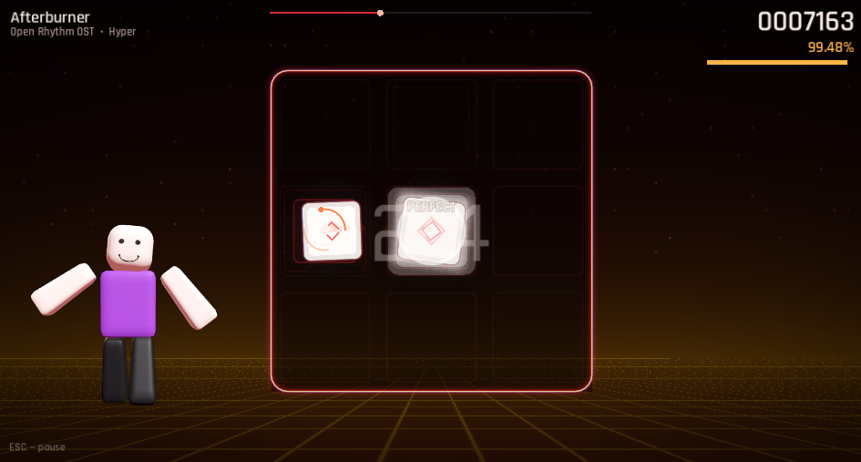
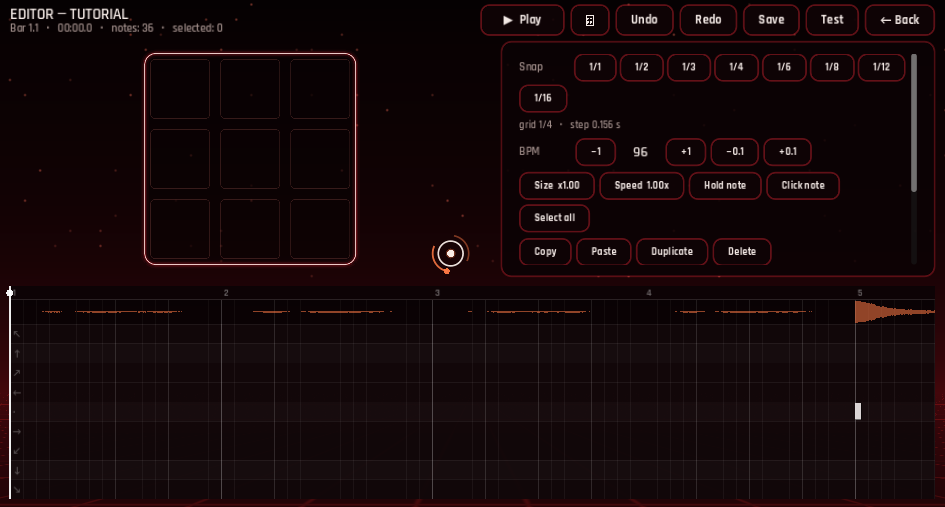
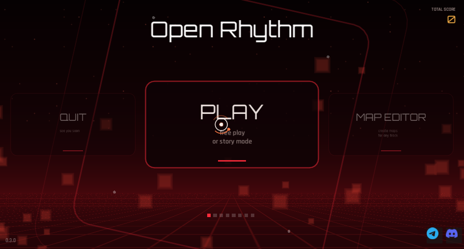
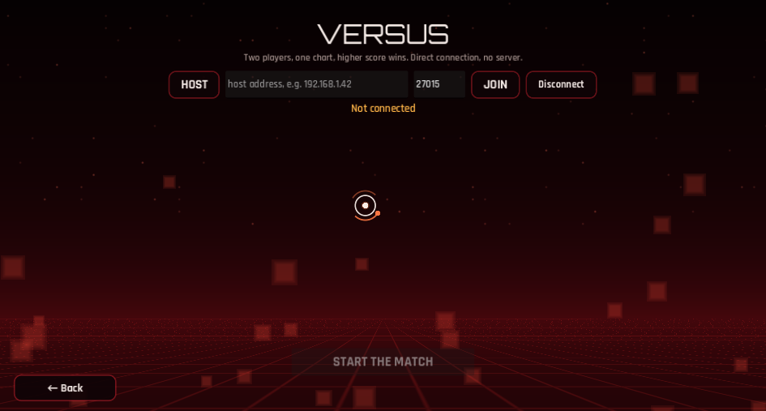
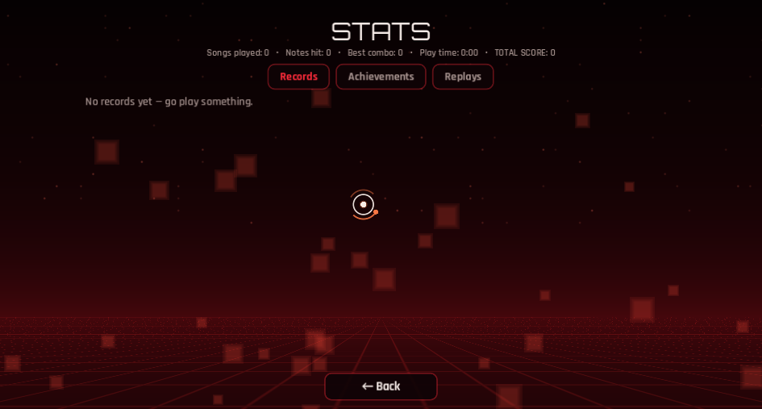

<div align="center">



**White cubes fly at a 3×3 grid. Your cursor has to be on the cube when it lands.**
Where inside the cell you caught it decides the rank — timing barely matters, aim does.

[](https://github.com/narezany/OpenRhythm/actions/workflows/build.yml)
[](https://github.com/narezany/OpenRhythm/releases/latest)
[](LICENSE)
[](https://godotengine.org)

[**Download**](https://github.com/narezany/OpenRhythm/releases/latest) ·
[Telegram](https://t.me/openrhythmforum) ·
[Discord](https://discord.gg/rc79e2sfqC)

</div>

> **Open Rhythm is a game, not a music player.** The tracks are here so there is
> something to play to. If a song is good, go listen to it where the artist
> actually gets paid.

<div align="center">



</div>

<table>
<tr>
<td width="50%"><br><sub><b>Map editor</b> — piano roll, waveform, beat grid, undo, hold dragging</sub></td>
<td width="50%"><br><sub><b>Main menu</b> — carousel, lifetime score, update banner</sub></td>
</tr>
<tr>
<td width="50%"><br><sub><b>Versus</b> — two players, one chart, no server in between</sub></td>
<td width="50%"><br><sub><b>Stats</b> — records, achievements, saved replays</sub></td>
</tr>
</table>

---

## Getting it

Grab a build for your platform from **[Releases](https://github.com/narezany/OpenRhythm/releases/latest)**.
The game checks for a newer release when the menu opens and offers to update
itself — one click, it downloads, installs and restarts. That check can be
turned off in *Settings → Video*.

Or run it from source with Godot 4.7:

```bash
godot --path .
```

<details>
<summary><b>What's in it</b></summary>

<br>

| | |
|---|---|
| **Square mode** | 3×3 grid, zone-based judging, PERFECT → BULLSHIT ranks |
| **Hold notes** | long cubes you have to carry to the end — nothing else is charted while one runs, because there is only one cursor |
| **Click notes** | cubes that have to be pressed, not just covered. Off by default; the CLICKS modifier turns on the ones a mapper put in |
| **Modifiers** | TARGET, BLACKOUT, CAGE, SPEED UP, SLOW DOWN, MIRROR, HIDDEN, CLICKS, CLICKY — each with its own score multiplier |
| **Three stories** | learn with Melly, then Night Drive, then Overdrive |
| **Six OST tracks** | written by `tools/gen_media.py` and `tools/gen_pack2.py`, with Easy / Normal / Hyper charts |
| **Map editor** | piano roll with a waveform and beat grid, snapping, undo, copy/paste, multi-select, hold dragging, and an onset-based auto-generator |
| **Map scripting** | a song can change the background colour, throw its own pictures behind the playfield, reskin the cubes and shake the camera |
| **Imports** | `.sspm` (Rhythia / Sound Space Plus, v1 and v2) and the legacy Sound Space map string |
| **Versus** | two players, one chart, higher score wins — a direct connection, no server |
| **Offset calibration** | tap along with a metronome and the game works out your audio delay |
| **Replays** | plus records, lifetime stats and 23 achievements |
| **Accessibility** | reduce motion, reduce flashes, cursor size, video off |
| **Six languages** | English, Russian, Chinese, German, Dutch, Spanish |
| **Controls** | mouse, touch, gamepad stick or keyboard, with rebindable keys |

Runs on Linux, Windows, Android and the web.

</details>

<details>
<summary><b>Adding your own songs</b></summary>

<br>

Drop a folder or a `.zip` into the library folder shown on the **Songs** screen,
then press **RESCAN**. A song folder is just this:

```
my_song/
├── map.json        required
├── audio.ogg       .wav, .ogg or .mp3
├── video.ogv       optional, played behind the playfield
└── events.json     optional, see map scripting
```

The **Songs** screen also imports `.sspm` maps from Rhythia / Sound Space
directly — audio and cover art come along with them.

Full format reference: **[docs/MAP_FORMAT.md](docs/MAP_FORMAT.md)**

</details>

<details>
<summary><b>Making maps</b></summary>

<br>

The 3×3 playfield on the left places notes at the playhead; the timeline at the
bottom is where you actually shape the chart.

| | |
|---|---|
| Space | play / pause |
| ← → | seek by the snap step (Shift: a bar) |
| 1…8 | snap 1/1 … 1/16 |
| Ctrl+Z / Ctrl+Y | undo / redo |
| Ctrl+C / Ctrl+V | copy / paste at the playhead |
| Ctrl+D | duplicate the selection forward |
| Ctrl+A / Delete | select all / delete the selection |
| H | toggle a one-beat hold on the selection |
| C | toggle click notes on the selection |
| Ctrl+S / T | save / test the chart |
| drag | rubber-band select |
| Ctrl+click | add a note |
| drag right edge | set a hold length |
| wheel / Ctrl+wheel / middle drag | scroll / zoom / pan |

Saving a song that ships with the game forks it into your library first — it
asks what to call the copy. `res://` lives inside the binary and cannot be
written to.

The waveform is drawn for `.wav` audio, or from a `waveform.json` if the song
ships one.

</details>

<details>
<summary><b>Versus</b></summary>

<br>

One player hosts, the other types their address. The connection is direct —
nothing goes through a server and nothing is uploaded anywhere, so both
machines have to be able to reach each other: the same network, or the host
forwarding port `27015`.

Both sides must be on the same build and holding the same chart. The handshake
compares a protocol number, the game version and a SHA-256 of the notes
themselves, so custom maps work exactly like the bundled ones as long as the
charts are identical. The audio file name and any video are left out of that
hash — neither changes what you play.

</details>

<details>
<summary><b>Building</b></summary>

<br>

Godot **4.7** with the matching export templates installed.

```bash
godot --headless --path . --export-release "Linux" build/linux/OpenRhythm.x86_64
godot --headless --path . --export-release "Windows Desktop" build/windows/OpenRhythm.exe
godot --headless --path . --export-release "Web" build/web/index.html
```

The web export needs cross-origin isolation headers (`COOP`/`COEP`) on the
host; itch.io has a checkbox for it. Theora video is excluded from the web
build, so songs with a clip play without one.

**Android signing.** Release credentials are never stored in
`export_presets.cfg` — CI fails the build if they end up there. Pass them
through the environment instead:

```bash
export GODOT_ANDROID_KEYSTORE_RELEASE_PATH=/path/to/release.keystore
export GODOT_ANDROID_KEYSTORE_RELEASE_USER=your-alias
export GODOT_ANDROID_KEYSTORE_RELEASE_PASSWORD=...
godot --headless --path . --export-release "Android" build/android/OpenRhythm.apk
```

CI builds the APK too, once the same key is stored as repository secrets
(`ANDROID_KEYSTORE_BASE64`, `ANDROID_KEYSTORE_USER`, `ANDROID_KEYSTORE_PASSWORD`);
without them that job simply skips.

**Releases** are cut by pushing a tag — CI builds every platform and attaches
the archives:

```bash
git tag v0.3.1 && git push origin v0.3.1
```

</details>

<details>
<summary><b>Music and rights</b></summary>

<br>

The bundled OST — Neon Drift, Hyper Drive, Midnight Pulse, Bass Rush, Crimson
Step, Afterburner and the tutorial track — is generated by the scripts in
`tools/` and ships under the project licence.

Any other song folder contains music by someone else. Those folders are **not**
part of this repository and must not be redistributed without the author's
permission. The game shows a notice on first launch pointing players at the
original releases.

If you are an artist and want a track out of the game, say so in
[Telegram](https://t.me/openrhythmforum) or
[Discord](https://discord.gg/rc79e2sfqC) and it goes.

</details>

<details>
<summary><b>Contributing</b></summary>

<br>

The most useful thing you can add is a map. Build one in the editor and open a
pull request with the song folder — **without the audio** unless you own it.

Code is plain Godot 4 + GDScript, no plugins. There is a headless test harness:

```bash
godot --headless --path . res://tools/CoreTest.tscn     # saves, judging, charts
godot --headless --path . res://tools/LayoutTest.tscn   # every screen, six aspect ratios
```

See **[CONTRIBUTING.md](CONTRIBUTING.md)** for house style, the translation
workflow and the chart generators.

</details>

---

<div align="center">

Code under [MIT](LICENSE) · fonts under [SIL OFL 1.1](assets/fonts/FONTS.md) · music per track

Made by **narezany**

</div>
