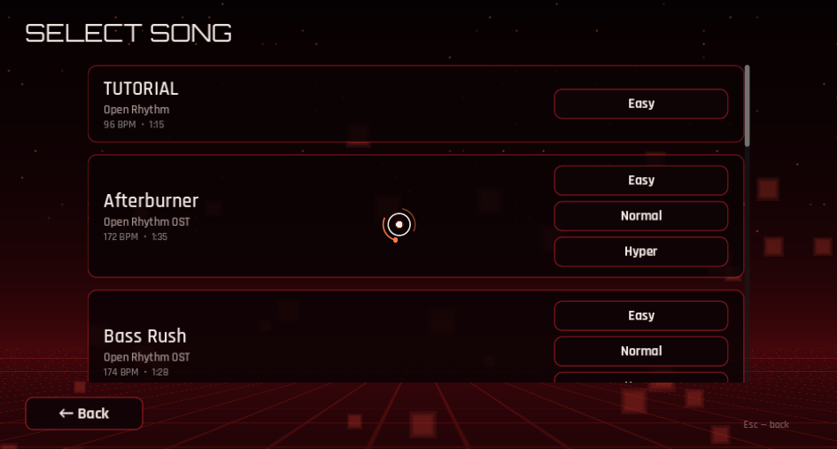

<div align="center">


**White cubes fly at a 3×3 grid. Your cursor has to be on the cube when it lands.**
Where inside the cell you caught it decides the rank — timing barely matters, aim does.

[](https://github.com/narezany/OpenRhythm/actions/workflows/build.yml)
[](https://github.com/narezany/OpenRhythm/releases/latest)
[](LICENSE)
[](https://godotengine.org)

[**Download**](https://github.com/narezany/OpenRhythm/releases/latest) ·
[**Play in a browser**](https://narezany.itch.io/open-rhythm) ·
[Telegram](https://t.me/openrhythmforum) ·
[Discord](https://discord.gg/rc79e2sfqC) ·
[Reddit](https://www.reddit.com/r/OpenRhythm/) ·
[YouTube](https://www.youtube.com/channel/UC4CKawg1MJ0bKah8IyvAyfg)

</div>

<div align="center">


</div>

<table>
<tr>
<td width="50%"><br><sub><b>Map editor</b> — piano roll, waveform, beat grid, undo, hold dragging</sub></td>
<td width="50%"><br><sub><b>Main menu</b> — carousel, lifetime score, update banner</sub></td>
</tr>
<tr>
<td width="50%"><br><sub><b>Song select</b> — modes, difficulties, records</sub></td>
<td width="50%"><br><sub><b>Stats</b> — records, achievements, saved replays</sub></td>
</tr>
</table>

---

## Getting it

Grab a build for your platform from **[Releases](https://github.com/narezany/OpenRhythm/releases/latest)**,
or play it in a browser on **[itch.io](https://narezany.itch.io/open-rhythm)**,
where the downloads live too.
The game checks for a newer release when the menu opens and offers to update
itself — one click, it downloads, installs and restarts. That check can be
turned off in *Settings → Video*.

Or run it from source with Godot 4.7:

```bash
godot --path .
```

<details>
<summary><b>What's in it</b></summary>

<br>

| | |
|---|---|
| **Square mode** | 3×3 grid, zone-based judging, PERFECT → BULLSHIT ranks |
| **Hold notes** | long cubes you have to carry to the end — nothing else is charted while one runs, because there is only one cursor |
| **Click notes** | cubes that have to be pressed, not just covered. Off by default; the CLICKS modifier turns on the ones a mapper put in |
| **Modifiers** | TARGET, BLACKOUT, CAGE, SPEED UP, SLOW DOWN, MIRROR, HIDDEN, CLICKS, CLICKY — each with its own score multiplier |
| **Three stories** | a visual novel with Melly: you are training for a laser tag regional and somebody told you this would fix your aim. Health along the bottom - miss enough in a row and the run stops there |
| **Six OST tracks** | written by `tools/gen_media.py` and `tools/gen_pack2.py`, with Easy / Normal / Hyper charts |
| **Map editor** | piano roll with a waveform and beat grid, snapping, undo, copy/paste, multi-select, hold dragging, and an onset-based auto-generator |
| **Map scripting** | a song can change the background colour, throw its own pictures behind the playfield, reskin the cubes, shake the camera and put captions up — edited on its own screen in the map maker, not by hand in a text file |
| **Imports** | `.sspm` (Rhythia / Sound Space Plus, v1 and v2) and the legacy Sound Space map string |
| **Offset calibration** | tap along with a metronome and the game works out your audio delay |
| **Replays** | plus records, lifetime stats and 23 achievements |
| **Coins** | clearing the game's own songs and stories pays purple coins; Melly's wardrobe is what they are for |
| **Accessibility** | reduce motion, reduce flashes, cursor size, video off |
| **Six languages** | English, Russian, Chinese, German, Dutch, Spanish |
| **Controls** | mouse, touch, gamepad stick or keyboard, with rebindable keys |
| **VR** | the desktop build opens in a headset when one is running and in a window when it is not. Aim with a laser pointer, or hold a saber in each hand and cut the cubes out of the air |

Runs on Linux, Windows, Android and the web.

</details>

<details>
<summary><b>Adding your own songs</b></summary>

<br>

Drop a folder or a `.zip` into the library folder shown on the **Songs** screen,
then press **RESCAN**. A song folder is just this:

```
my_song/
├── map.json        required
├── audio.ogg       .wav, .ogg or .mp3
├── video.ogv       optional, played behind the playfield
└── events.json     optional, see map scripting
```

The **Songs** screen also imports `.sspm` maps from Rhythia / Sound Space
directly — audio and cover art come along with them.

Full format reference: **[docs/MAP_FORMAT.md](docs/MAP_FORMAT.md)**

</details>

<details>
<summary><b>Making maps</b></summary>

<br>

The 3×3 playfield on the left places notes at the playhead; the timeline at the
bottom is where you actually shape the chart.

| | |
|---|---|
| Space | play / pause |
| ← → | seek by the snap step (Shift: a bar) |
| 1…8 | snap 1/1 … 1/16 |
| Ctrl+Z / Ctrl+Y | undo / redo |
| Ctrl+C / Ctrl+V | copy / paste at the playhead |
| Ctrl+D | duplicate the selection forward |
| Ctrl+A / Delete | select all / delete the selection |
| H | toggle a one-beat hold on the selection |
| C | toggle click notes on the selection |
| Ctrl+S / T | save / test the chart |
| drag | rubber-band select |
| Ctrl+click | add a note |
| drag right edge | set a hold length |
| wheel / Ctrl+wheel / middle drag | scroll / zoom / pan |

**Details…** on a map of your own opens everything that is not the notes: its
title, the artist, the names of its difficulties, and adding or removing them.
All of that lived in `map.json` and nowhere else, so fixing a typo used to mean
editing the file by hand.

**Events…** opens the song's storyboard — backgrounds, note skins, camera moves
and captions, on a timeline of their own. It reads and writes the same
`events.json` a map has always carried; what it adds is knowing which arguments
each command takes, so the fields on screen are the fields that command has.

Saving a song that ships with the game forks it into your library first — it
asks what to call the copy. `res://` lives inside the binary and cannot be
written to.

The waveform is drawn for `.wav` audio, or from a `waveform.json` if the song
ships one.

</details>

<details>
<summary><b>VR</b></summary>

<br>

**PC VR works.** Played through WiVRn on a Radeon RX 580: the room, the screen,
the cubes, the pointer and the sticks. **Standalone headsets do not yet** — the
Quest and Pico packages still crash inside the engine's own OpenXR before a line
of game code runs, and 0.4 does not ship them. What has been ruled out and what
it needs next is in [docs/VR_STATUS.md](docs/VR_STATUS.md).

There is no separate VR build and no switch to flip. The desktop game looks for
an OpenXR runtime at startup: one running means it opens in VR, nothing there
means it opens in a window. *Settings → VR* can say no.

One thing happens behind your back, and it is worth knowing about. The game
ships on the Compatibility renderer because that is what phones want, and that
renderer draws both eyes at once through `GL_OVR_multiview2` — which Mesa
offers to GLES contexts only, while Godot on Linux draws through desktop GL.
The engine asks for multiview anyway, every 3D shader fails to compile with
`gl_ViewID_OVR undeclared`, and the headset shows an empty room while head
tracking works perfectly. It cannot be fixed with a setting, because the
renderer is chosen before the engine knows a headset is there. So when a
runtime is installed and the game is on the wrong renderer, it starts itself
again on Vulkan and steps aside — giving the new copy a moment to prove it is
alive first, because a machine with no working Vulkan has to end up with a flat
game rather than with no game.

**Sabers** are what a headset opens with. There is no grid: the cube is the
target and you cut it where it is, with any part of the blade from any
direction. The rank comes from timing rather than from where in a cell a cursor
was — there is no cell to be off-centre in when you meet a cube in the air — and
it says how far off you were in milliseconds. Long notes do not exist in saber
play; a hold arrives as a burst of ordinary cubes in one spot. Ringed cubes
cannot be cut at all: hold the trigger and the blade goes live, and a live blade
passes through plain cubes and burns the ringed ones.

**The laser pointer** is the other way to play, and the one a flat screen and a
mouse are already doing. Both hands hold a pointer and only one of them works;
which one is a setting, so the game can be played left-handed.

The left stick walks and the right one turns, about your own head. The room is
built under your measured eye height rather than at a height in metres. Melly
stands in it, can be patted, and can be picked up by the grip — they go limp in
your hand and fall to the floor when you let go. Grip + B recentres, and the
menu button steps back the way Esc does.

Everything else is the flat game: the same charts, the same judging, the same
menus and editor, on a screen hanging in front of you. Only the cubes come out
of it into the room.

Quest and Pico packages can still be built, and still crash. They need the
OpenXR loaders, which are not in this repository:

```bash
curl -LO https://github.com/GodotVR/godot_openxr_vendors/releases/download/5.1.0-stable/godotopenxrvendorsaddon.zip
unzip -q godotopenxrvendorsaddon.zip -d /tmp/vendors
cp -r /tmp/vendors/asset/addons/godotopenxrvendors addons/

godot --headless --path . --install-android-build-template
tools/build_headsets.sh
```

Those are gradle builds, so they need the Android SDK and a JDK the same way the
phone package does. They also need the **Mobile** renderer, for the same reason
the desktop needs Vulkan — and since the engine picks a renderer before it knows
an export's custom features, the script flips the setting for the length of
those builds and checks that it was put back.

</details>

<details>
<summary><b>Building</b></summary>

<br>

Godot **4.7** with the matching export templates installed.

```bash
godot --headless --path . --export-release "Linux" build/linux/OpenRhythm.x86_64
godot --headless --path . --export-release "Windows Desktop" build/windows/OpenRhythm.exe
godot --headless --path . --export-release "Web" build/web/index.html
```

The web export needs cross-origin isolation headers (`COOP`/`COEP`) on the
host; itch.io has a checkbox for it. Theora video is excluded from the web
build, so songs with a clip play without one.

**Android signing.** Release credentials are never stored in
`export_presets.cfg` — CI fails the build if they end up there. Pass them
through the environment instead:

```bash
export GODOT_ANDROID_KEYSTORE_RELEASE_PATH=/path/to/release.keystore
export GODOT_ANDROID_KEYSTORE_RELEASE_USER=your-alias
export GODOT_ANDROID_KEYSTORE_RELEASE_PASSWORD=...
godot --headless --path . --export-release "Android" build/android/OpenRhythm.apk
```

CI builds the APK too, once the same key is stored as repository secrets
(`ANDROID_KEYSTORE_BASE64`, `ANDROID_KEYSTORE_USER`, `ANDROID_KEYSTORE_PASSWORD`);
without them that job simply skips.

**Releases** are cut by pushing a tag — CI builds every platform and attaches
the archives:

```bash
git tag v0.4 && git push origin v0.4
```

</details>

<details>
<summary><b>Music and rights</b></summary>

<br>

The bundled OST — Neon Drift, Hyper Drive, Midnight Pulse, Bass Rush, Crimson
Step, Afterburner and the tutorial track — is generated by the scripts in
`tools/` and ships under the project licence.

Music by anyone else is **not** built into the game and is **not** in this
repository. It travels as an installable song zip instead - drop the file in
the songs folder and the game unpacks it on the next scan:

```bash
python3 tools/pack_song.py local_songs/my_song
```

Keep those folders in `local_songs/` with an empty `.gdignore` beside them, or
the engine will import and pack them anyway - that one file is the difference
between a 37 MB download and a 96 MB one.

That keeps someone else's recording out of the build, and out of every clone of
this repo, while still being one file to hand a friend.

If you are an artist and want a track out of the game, say so in
[Telegram](https://t.me/openrhythmforum) or
[Discord](https://discord.gg/rc79e2sfqC) and it goes.

</details>

<details>
<summary><b>Contributing</b></summary>

<br>

The most useful thing you can add is a map. Build one in the editor and open a
pull request with the song folder — **without the audio** unless you own it.

Code is plain Godot 4 + GDScript, no plugins. There is a headless test harness:

```bash
godot --headless --path . res://tools/CoreTest.tscn     # saves, judging, charts, coins, fonts
godot --headless --path . res://tools/LayoutTest.tscn   # every screen, six aspect ratios
```

Both are run before every commit that touches the game. CoreTest holds the
things that are cheap to get wrong and expensive to notice: that no project
setting has a comment folded into its name, that every language the game is
translated into can be drawn by the fonts it ships, that the auto builder's
pattern pools name shapes that exist, and that a wardrobe costs real play.

See **[CONTRIBUTING.md](CONTRIBUTING.md)** for house style, the translation
workflow and the chart generators.

</details>

---

<div align="center">

Code under [MIT](LICENSE) · fonts under [SIL OFL 1.1](assets/fonts/FONTS.md) · music per track

<sub>Four fonts ship, not two: Rajdhani and Orbitron are Latin, so Exo 2 carries
Cyrillic and a cut-down Noto carries Chinese and the symbols. On a desktop the
system lends what is missing; a browser has nothing to lend, and the web build
used to print the Russian translation as boxes with hex codes in them.</sub>

Made by **narezany**

</div>
